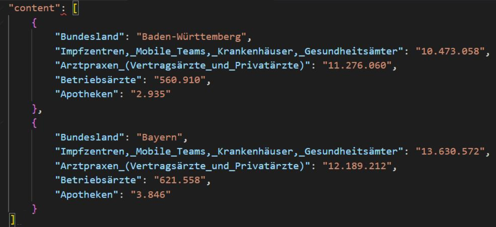

Meeting 11.05.2022

## Teilnehmer

**Anwesend**|**Name**|**Rolle**
:-----:|:-----:|:-----:
x|Holger|Betreuer
x|Hui|Student

## Themen

- die vorhandende Ergibnisse
- schriftliche Ausarbeitung

## TODOS

- die normalizierte Einschreiung von einfacher Tabelle ändern
  
  es sollte sein:

  

- als Ausblick - wie schmelzt man Zeilenindex
- schriftliche Ausarbeitung
  
  Thema: mit Hilfe des tiefen neuronalen Netzwerks

