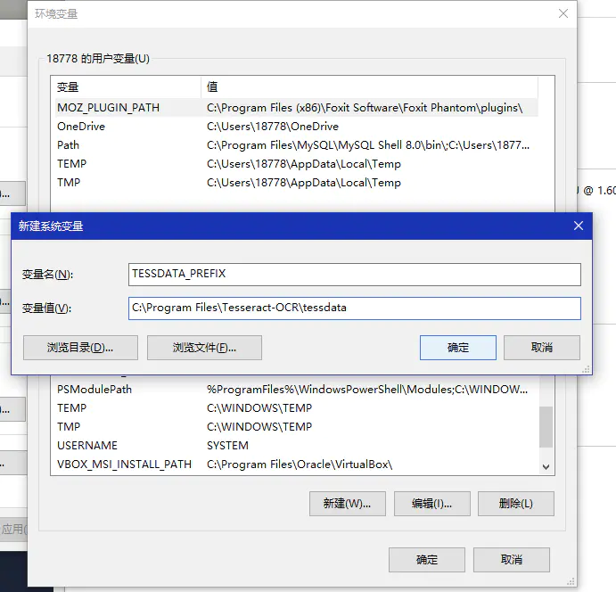

# 2022-projektarbeit-hui-chen

- Hier ist der Arbeitsplatz für die Studienarbeit “Automatische Erkennung und Konvertierung von Tabellen in Bilddokumenten”.

## TODOS

- Nachdem die Arbeit endet, sollte hier aufgeräumt werden.

## Programmablauf
Der Ablauf des Programmes kann anhand den Folgenden  nachvollzogen werden:

## Setup

- Install Python & pip
- Install OpenCV package for Python: `pip install opencv-python`
- Tesseract für Windows:
  - Information für [Download](<https://github.com/tesseract-ocr/tessdoc/blob/main/Downloads.md>)
  - auf [UB-Mannheim](https://github.com/UB-Mannheim/tesseract/wiki) klicken
  - die entsprechende Version herunterladen
  - Tesseract-OCR installieren

    
  - den Installationspfad wählen
    
    
  - zu den Systemvariablen (PATH) der Umgebungsvariablen hinzufügen

    
    
  - eine neue Systemvariable erstellen
    - Variablename: TESSDATA_PREFIX-Variablennamen 
    - Variablenwert ist Installationspfad, z.B. C:\Program Files\Tesseract-OCR\tessdata

    
  - in der Datei _pytesseract.py_ (unter dem Pfad, den Sie gerade installiert haben) ändern `tesseract_cmd = 'tesseract'`  in `tesseract_cmd =r'C:\Program Files\Tesseract-OCR\tesseract.exe"`
    
    oder: einfach in python-code `pytesseract.pytesseract.tesseract_cmd = 'C:\\Program Files\\Tesseract-OCR\\tesseract.exe'` nutzen
  - Install Tesseract package for Python: `pip install pytesseract`
- install PIL package
- install pandas
- install elasticsearch
- install pytorch
- install matplotlib
- install albumentations==0.4.6
- install numpy
