# 2022-studienarbeit-hui-chen

**Ein Tool zur Erkennung, Extraktion und Rekonstruktion von komplexen Tabellen aus Bilddokumenten**

## Programmablauf
Der Ablauf des Programmes kann anhand den Folgenden  nachvollzogen werden:
- Die Verarbeitung einzeles Bilds

  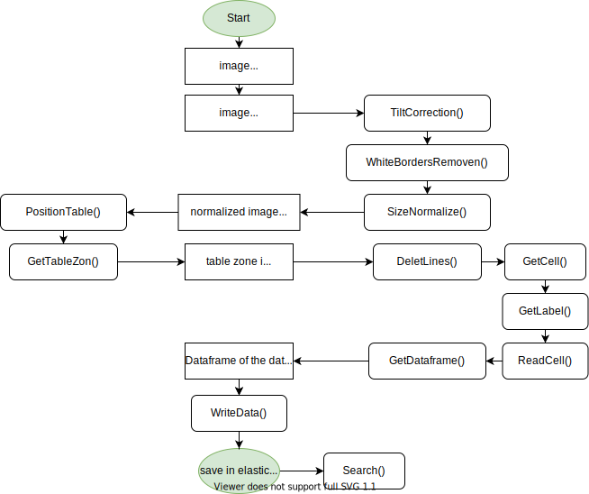

- Stapelverarbeitung mehrer Bilder

  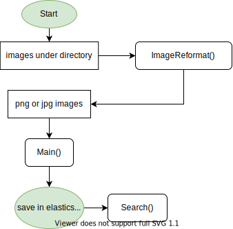

## Ergebniss
- Die Verarbeitung einzeles Bilds
   - Vorbreitung und Normalizierung

   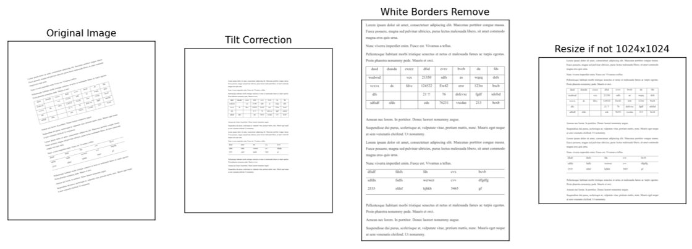

   - Erkennung des Tablebreichs

   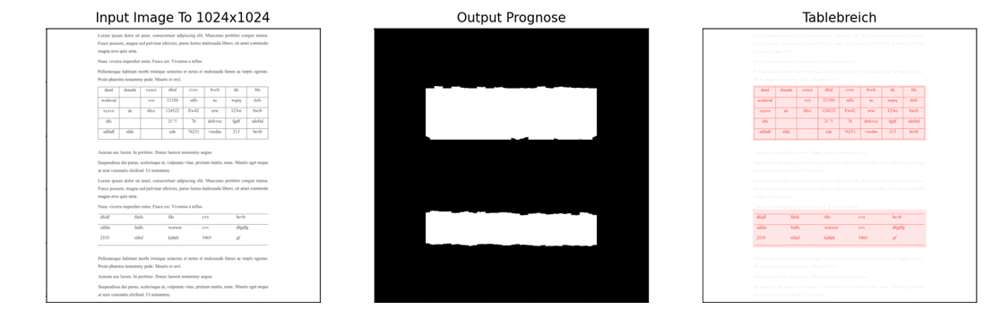

   - Erkennung der Zelle

   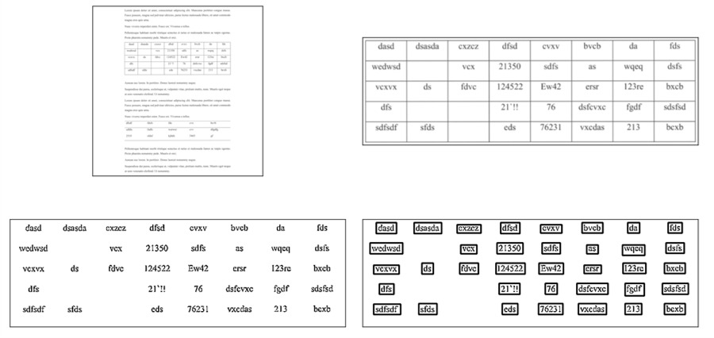

   - Rekonstruktion
      - Columen Detection mittels ML Modell, somit werden Labels von Columen erstellt.
      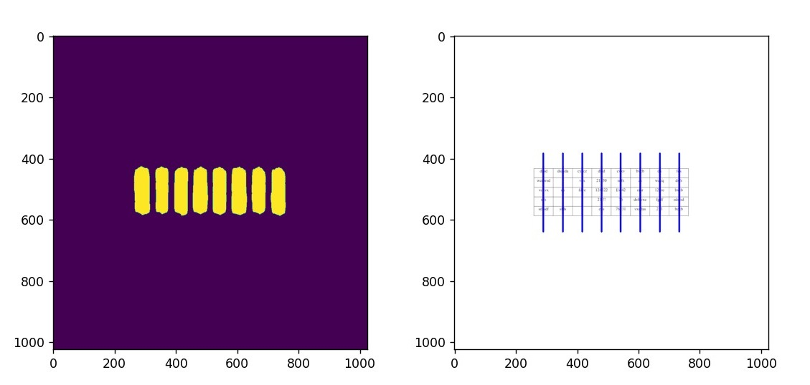
      (Die rote Linie ist die Mittellinie der durch maschinelles Lernen erkannten Tabellenspalte, und die Zellen, die sich auf beiden Seiten der roten Linie innerhalb der grünen Linien befinden, werden in einer Spalte gruppiert.)

      - Zuweisung der Labels
      
      Labels von Rows werden durch Positon von jeder Zelle erstellt.

      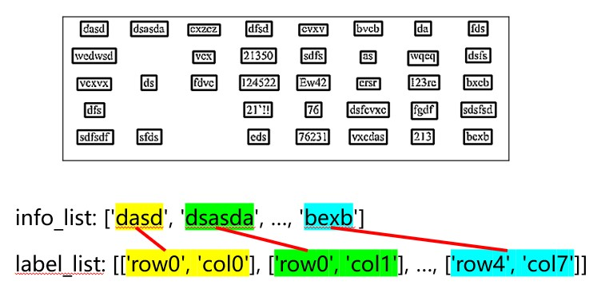

      - Rekonstruktion

      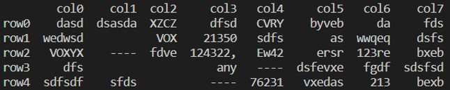

      - Strukturnormalize

      

- Stapelverarbeitung mehrer Bilder

   - Die Bilder im Verzeichnis werden zuerst formatiert,  alle PDFs werden Seite für Seite in das PNG-Dateiformat konvertiert.

   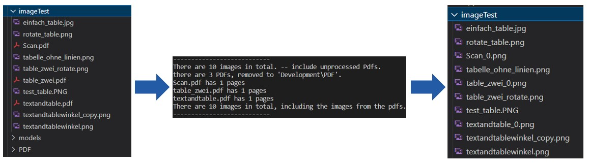

   - Dann wird jedes Bild verarbeitet und in Elasticsearch geschrieben.

   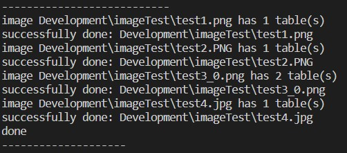

   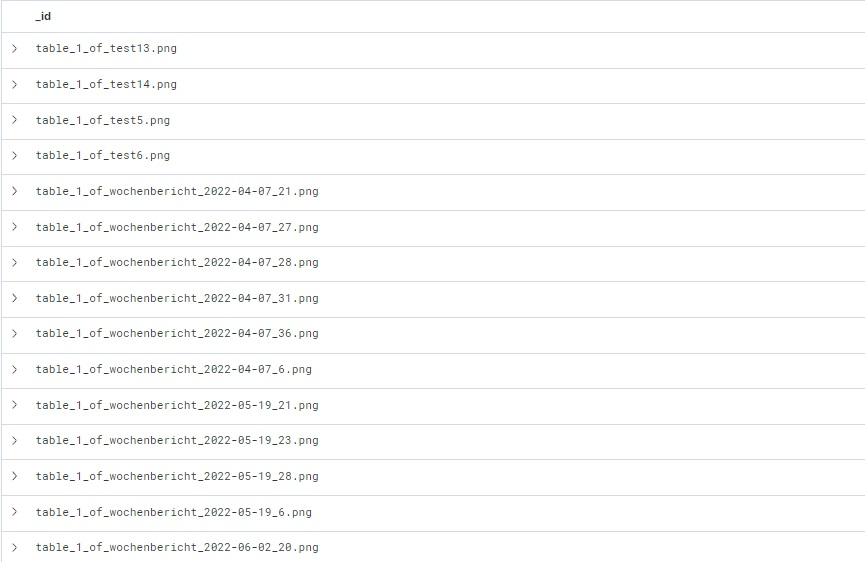

- Leistung bei komplexer Tabelle
  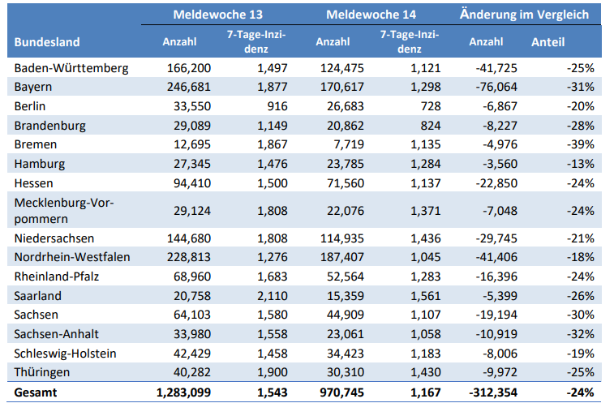
  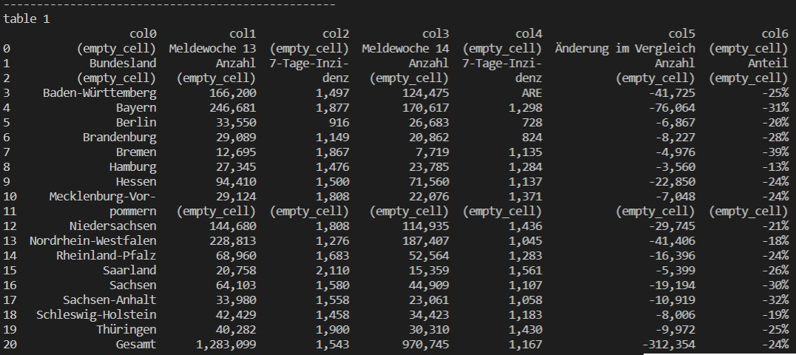

  nach Strukturnormalize:

  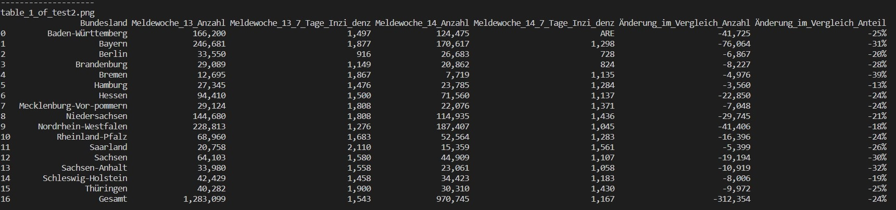

## Config
- python 3.10.0
- elasticsearch==7.17.1
- elasticsearch-dsl==7.4.0
- matplotlib==3.5.2
- numpy==1.22.4
- opencv-python==4.6.0.66
- opencv-contrib-python==4.6.0.66
- pandas==1.3.4
- torch==1.11.0+cu113
- torchvision==0.12.0+cu113
- albumentations==0.4.6 
- Pillow==9.1.0
- pytesseract==0.3.9
- tesseract-ocr==v5.2.0.20220712
- fitz==0.0.1.dev2

## Setup

- Install Python & pip
- Install *packagename* package for Python: `pip install *packagename*`
  packages: _Pillow_, _pandas_, _matplotlib_, _albumentations_, _numpy_, _opencv-contrib-python, _opencv-python_, _fitz_
  
  Die entsprechende empfohlene Version finden Sie in **Config** 

  Oder einfach: `pip install -r requirements.txt`
  
  Achtung: Die Version von albumentations muss 0.4.6 sein, sowie opencv-python neuer als 4.5.x. 

- Installation von *Elasticsearch*

  Elasticsearch kann nach folgender Anleitung installiert werden: [Installation Elasticsearch](https://youtu.be/Tn6zkPz-qHc?t=553)

  1. Elasticsearch unter [elastic.co/start](https://www.elastic.co/de/start) herunterladen
  2. Datei Entpacken
  3. Navigation in den Ordner *bin*
  4. *elasticsearch.bat* ausführen, um die Installation zu starten
  5. `localhost:9200` im Browser eingeben, um erfolgreiche Installation zu testen

  Zum Ausführen in Python muss noch die Bibliothek installiert werden.
Dies kann im Terminal durch folgenden Befehl getan werden: `pip install elasticsearch`

- Installation von *Tesseract für Windows*:
  - Information für [Download](<https://medium.com/quantrium-tech/installing-and-using-tesseract-4-on-windows-10-4f7930313f82>)
  - auf [UB-Mannheim](https://github.com/UB-Mannheim/tesseract/wiki) klicken
  - die entsprechende Version herunterladen
  - Tesseract-OCR installieren

    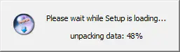

  - alle Sprache auswählen

    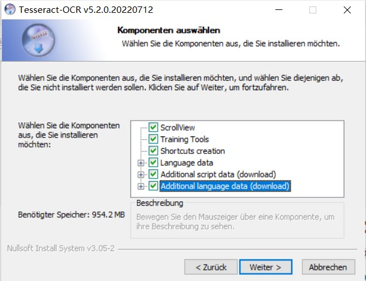
  - den Installationspfad wählen
    
    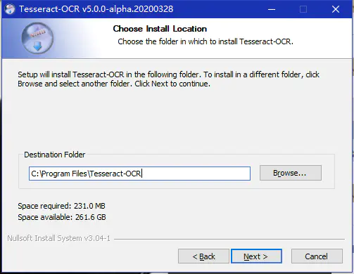

  - zu den Systemvariablen (PATH) der Umgebungsvariablen hinzufügen

    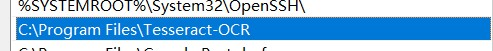
    
  - eine neue Systemvariable erstellen
    - Variablename: TESSDATA_PREFIX 
    - Variablenwert ist Installationspfad, z.B. C:\Program Files\Tesseract-OCR\tessdata

    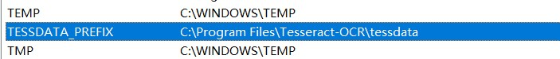

  - in der Datei _pytesseract.py_ (unter dem Pfad, den Sie gerade installiert haben) ändern `tesseract_cmd = 'tesseract'`  in `tesseract_cmd =r'C:\Program Files\Tesseract-OCR\tesseract.exe"`
    
    oder: Bei Verwendung der Tesseract-OCR in python-code einfach `pytesseract.pytesseract.tesseract_cmd = 'C:\\Program Files\\Tesseract-OCR\\tesseract.exe'` nutzen
  - Install Tesseract package for Python: `pip install pytesseract`

- Install pytorch
  - bekommen Command for Installation hier [Pytorch](https://pytorch.org/get-started/locally/)

  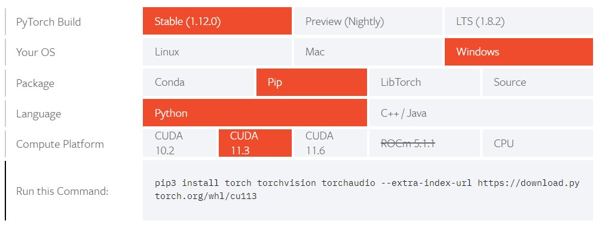
  
  - kopieren und füren den Command in Terminal durch wie z.B. `pip3 install torch torchvision torchaudio --extra-index-url https://download.pytorch.org/whl/cu113`
