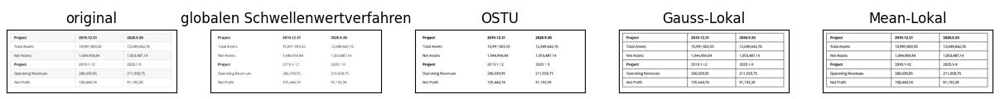

# Schriftliche Ausarbeitung

## Titelseite

**Projektarbeit**

*Automatisierte Erfassung und Extraktion von Daten aus Tabellen in Dokumenten.*

Name: Hui Chen
Matr.-Nr.: 10048521

## Einleitung

## Grundlagen

- Daten, Informationen, Wissen (--> Pyramide)
- Tabellen
- Python
- Maschinen Learning

## Stand der Technik

- [OpenCV][1]
- Tesseract
- Maschinen Learning
- GOOGLE COLAB

## Implementierung

### Idee & Planung

- mit idealem Bild starten und wenn Extraktion erfolgreich ist, auch nicht-optimale Bilder erproben

#### Ablauf

- ggf. Korrektur von Fehlern (z.B. tilt, Artefakte)
- Binärisierung
- Detektion von Tabellenbreich
- Detektion von Zellen
- OCR auf Zelle
  - Oberste Zeile (header) --> keys (= Feldnamen; z.B. "Datum", "Name", ...)
  - Zeilen darunter --> values (= Werte; z.B. "12-02-22", "Mustermann", ...)
- Erstellung von Datenobjekten je Zeile mit keys aus header
- Speicherung von Datenobjekten in Datenbank (Elasticsearch)

#### Funktionsarchitektur

- es gibt zwei Funktionsarchitekturen/Programme:
  - Training
  - Produktiver Einsatz

##### Training

- Bilder und Masken werden manuell bereitgestellt
- Modell wird durch Vorgaben des Menschen trainiert
- Am Ende steht ein fertiges Modell, dass auch ohne Training also "offline" genutzt werden kann.

##### Produktiver Einsatz

- Das Programm für den produktiven Einsatz nutzt das trainierte Modell

- `extractTableDataFromPdfFile(pdfFilePath)`
  - `pdfFileToPngFiles(pdfFilePath, tempFolderPath)` (return: void)
  - `detectTablesInPngFiles(tempFolderPath)` (return: void)
    - `detectTableInPngFile(pngFilePath)` (return: {xPositionTable, yPositionTable}) &larr; hier wird das trainierte Modell genutzt!
    - `extractTableDataFromPngFile(pngFilePath, xPostionTable, yPositionTable)` (return: {headerData, rowData[]})

### Programmierung

#### Tabellentypen

#### Binarization

## Diskussion
- Normalerweise besteht keine starke Korrelation zwischen den beiden Tabellen, daher werden sie als separate Blöcke in das Verzeichnis geschrieben.
- Um die Tabellenstruktur möglichst nicht zu zerstören, werden ,,Header" und ,,Wert" auf gleicher Ebene in Elasticsearch geschrieben.

## Zusammenfassung
- In dieser Studienarbeit werden eine Methode zur Automatisierte Erfassung und Extraktion von Daten aus Tabellen bringen, mittels Maschinen Learing gibt es bei der Erkennung von Tablebreich mehr Robustness, und mittels traditioneller Verfahrensweisen hat die Rekonstruktion mehr Genauigkeit.

## Ausblick
- Die Einfernung von Weißrand wäre mittels ML robuster. Dadurch könnte Schwarzrand sowie komplexer Rand auch entfernt werden.

## Quellen

- [1]: <https://de.wikipedia.org/wiki/OpenCV>
